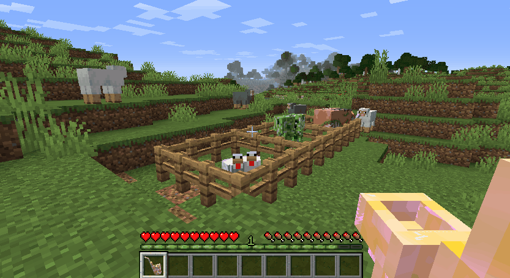
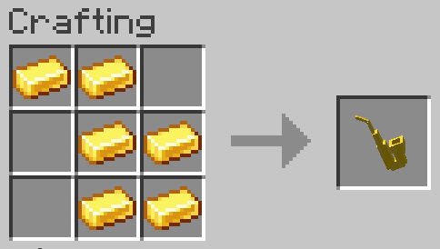
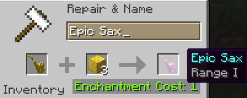

# Epic Sax Guy

**_Oh forget, let me breathe, let me live. 
Just run away from my mind!_**

Adds an epic sax that affects mobs.

## GIFs
<figure>
    
      <em>Killing mobs with an epic sax</em>
</figure>

## Recipes
To craft the saxophone, you only need gold ingots.

<figure>
    
      <em>The saxophone crafting</em>
</figure>

## Enchantments
A saxophone alone only plays the wonderful Epic Sax Guy song.
However, to add power to it you'll have to enchant the sax. 

### How to apply them

To add an enchantment you'll need an anvil, a valid modifier, and 1lvl of XP.

<figure>
    
      <em>An example of modifier enchantment using a Gold Block</em>
</figure>

### Modifiers

Check out the sax modifiers bellow:

| Modifier | Description | 
| -------- | ----------- |
| TNT | Explodes every mob who enters a sax range |
| Flint and Steel | Ignites every mob who enters a sax range |
| Feather | Levitates every mob who enters a sax range |
| Soul Sand | Slows down every mob who enters a sax range |
| Gold Block | Multiplies the range of a sax. Can be applied up to 8x |
| Nether Star | Increases the sax range to 120 blocks |

> **NOTE:** The base range is 3. With the range modifier it turns into 3*RangeEnchantmentLvl

## Credits
Also, I want to give credits to the band who originally performed this song. Check out [their performance at the Eurovision Contest](https://www.youtube.com/watch?v=pHXDMe6QV-U).

> If you didn't get the reference, just look at how incredible is the saxophonist performance, and then you'll understand why it became a meme in 2010.

Also², I want to give credits to the mod I got inspiration for making this one. It was developed for Garry'sMod, and it is downloadable through [this workshop link](https://steamcommunity.com/sharedfiles/filedetails/?id=131710286).

I hope you enjoy playing with this mod. Don't forget to subscribe to [my YouTube channel](https://www.youtube.com/c/nickoff755/videos) for any new mods, and to give this repository a star.

❤️ Made with love by Nickoff
